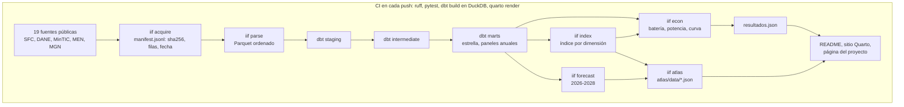

# Inclusión financiera y crecimiento regional en Colombia

[](https://github.com/DavinsonR/financial-inclusion-colombia/actions/workflows/ci.yml)
[](LICENSE)
[](docs/LICENCIAS_DATOS.md)


[](CITATION.cff)

*[Read in English](README.md)*

**Investigación reproducible: warehouse abierto de 19 fuentes públicas, índice de inclusión financiera por dimensiones, paneles anuales departamental y municipal, atlas interactivo de los 1.123 municipios y batería econométrica completa contra la correlación espuria.**

**Davirson Novoa Ramírez** · GitHub [@DavinsonR](https://github.com/DavinsonR) · [davirson.com](https://davirson.com) — una sola persona y un solo nombre en el repositorio, la ficha de cita y la página del proyecto.

## En breve

- **La pregunta.** ¿Crecen más rápido las regiones de Colombia con más acceso a servicios financieros, una vez se descuentan los vaivenes nacionales que golpean a todas a la vez?
- **La respuesta.** Una cota, no una ausencia: el diseño descarta efectos grandes y dice abiertamente qué tan pequeño es el efecto que no podría ver. Las cifras, con su potencia, están en [Resultado principal](#main-result).
- **Por qué creerle.** Sin efectos de tiempo el mismo coeficiente parece fuertemente positivo (+0,027); al quitar las tendencias nacionales desaparece. En la curva de especificación, 50 de 80 especificaciones salen significativas sin efectos de tiempo y 5 de 80 con ellos.
- **Qué puedes reutilizar.** El warehouse, el índice para cada municipio, el atlas y el código, con licencias abiertas. Resumen de una página: [`docs/CASO_DE_ESTUDIO.md`](docs/CASO_DE_ESTUDIO.md).

## Por qué importa

La inclusión financiera es una meta de política en Colombia y en América Latina, y a menudo se defiende con correlaciones regionales. Este proyecto muestra cuánto de esa correlación es la tendencia nacional, mide el efecto más pequeño que los datos habrían podido detectar y publica el resultado con su potencia en lugar de escoger la especificación que mejor se ve. El método sirve para cualquier pregunta del tipo "¿X predice el crecimiento regional?" construida con datos públicos.

Para quien trabaja con datos, las piezas reutilizables son concretas: un warehouse limpio, con claves DIVIPOLA y huella de cada descarga, de los reportes de inclusión de la Superintendencia Financiera y las cuentas regionales del DANE; un índice por municipio con sus pesos publicados, y un mapa que cualquiera puede abrir sin instalar nada.

Tesis de Maestría en Economía, Pontificia Universidad Javeriana (2026; director: Gabriel Penagos Londoño). Pregunta: ¿la inclusión financiera predice el crecimiento de los departamentos una vez descontadas las tendencias nacionales que los mueven a todos a la vez? La respuesta se publica con su especificación, su N, sus clústeres y sus pruebas, sea cual sea el signo.

Página del proyecto y atlas interactivo: <https://davirson.com/es/research/fintech-inclusion>.

## Empieza aquí en 5 minutos

1. [Resultado principal](#main-result): el hallazgo, su cota y por qué la estimación ingenua engaña.
2. [`docs/CASO_DE_ESTUDIO.md`](docs/CASO_DE_ESTUDIO.md): problema, datos, las cuatro decisiones que dieron forma a la respuesta y el stack, en una página.
3. [`src/iif/econ/power.py`](src/iif/econ/power.py): cómo un resultado nulo se convierte en una cota (efecto mínimo detectable y prueba de equivalencia).
4. [`dbt/tests/assert_cifras_publicadas.sql`](dbt/tests/assert_cifras_publicadas.sql) y [`tests/test_resultados_publicados.py`](tests/test_resultados_publicados.py): las pruebas que fallan si una cifra publicada se separa del código.
5. [El atlas](https://davirson.com/es/research/fintech-inclusion): el índice para 33 departamentos y 1.123 municipios, en el navegador.

## Qué demuestra este proyecto

| Habilidad | Dónde verla |
|---|---|
| Adquisición de datos con procedencia (URL, sha256, filas, fecha de la fuente) | [`src/iif/acquire/`](src/iif/acquire/), [`config/sources.yaml`](config/sources.yaml), `data/raw/manifest.jsonl` |
| Analytics engineering: esquema en estrella, staging → intermediate → marts, pruebas de datos | [`dbt/models/`](dbt/models/), [`dbt/tests/`](dbt/tests/) |
| Construcción de un índice que mide sus supuestos primero (KMO antes de PCA, pesos implícitos publicados) | [`src/iif/index/`](src/iif/index/), [`config/index.yaml`](config/index.yaml), [ADR-015](docs/decisiones/ADR-015-seleccion-de-variables-del-indice.md) |
| Econometría de panel: efectos fijos de dos vías, CCE, diseño de exposición inicial, estudio de eventos con tendencias previas, SLX espacial, wild cluster bootstrap studentizado con el error agrupado, corrección de Holm | [`src/iif/econ/`](src/iif/econ/), [`metodologia/panel.qmd`](metodologia/panel.qmd) |
| Potencia estadística y prueba de equivalencia para un resultado nulo | [`src/iif/econ/power.py`](src/iif/econ/power.py), [`tests/test_power.py`](tests/test_power.py), [ADR-018](docs/decisiones/ADR-018-potencia-y-equivalencia.md) |
| Curva de especificación (160 especificaciones) | [`src/iif/econ/curve.py`](src/iif/econ/curve.py), [`metodologia/especificaciones.qmd`](metodologia/especificaciones.qmd) |
| Pronóstico con evaluación honesta (backtest, Diebold-Mariano agrupado por origen) | [`src/iif/forecast/`](src/iif/forecast/), [ADR-023](docs/decisiones/ADR-023-diebold-mariano-agrupado-por-origen.md) |
| Geovisualización interactiva (Observable JS, d3, TopoJSON) | [`atlas/index.qmd`](atlas/index.qmd), [`src/iif/export/`](src/iif/export/) |
| Reproducibilidad y CI: dependencias bloqueadas, acciones fijadas, cada cifra rederivada | [`.github/workflows/ci.yml`](.github/workflows/ci.yml), [`Makefile`](Makefile), `uv.lock` |
| Registro de decisiones y bitácora de causa raíz | [`docs/decisiones/`](docs/decisiones/README.md) (25 ADR), [`docs/BITACORA_AGENTE.md`](docs/BITACORA_AGENTE.md) |
| Diseño de warehouse en la nube (escrito, sin ejecutar contra un proyecto real) | [`bigquery/`](bigquery/) |

*English summary: see [Abstract](#abstract).*

<a id="status"></a>
## Estado

| Fecha | Hito |
|---|---|
| ago-2026 | Tesis radicada ante la Dirección de Posgrados |
| sep-2026 | Fase 0: paquete `iif`, documentos de gobierno, dbt, sitio y CI |
| sep-2026 | Fase 1: las 19 fuentes descargadas con manifiesto, claves DIVIPOLA, staging de las 13 tablas, SFC en largo, empalme 2021Q1 medido |
| sep-2026 | Fase 2: hechos y paneles anuales, índice por dimensiones con pesos publicados |
| sep-2026 | Fase 3: atlas de tres vistas y batería econométrica con sus resultados (ADR-016) |
| sep-2026 | Capa de proyección 2026–2028: motor y exportación al atlas (ADR-019 a ADR-023) |
| sep-2026 | Auditoría de cierre: correcciones del referee a la inferencia y robustez nueva (ADR-024), distancia tipo Sarma corregida (ADR-025) |
| sep-2026 | Proyecto cerrado. Diferidos como trabajo futuro, no pendientes: el anexo de desagregación temporal y el manuscrito (fase 4) |
| nov-2026 (previsto) | Grado |

El plan completo, con semáforo por fase y las decisiones de valor, está en [`docs/GUIA_DEL_PROYECTO.md`](docs/GUIA_DEL_PROYECTO.md).

## Qué construye

1. **Warehouse.** Esquema estrella en dbt sobre todas las fuentes públicas, con la vintage de cada descarga registrada en `data/raw/manifest.jsonl` (la tabla `dim_vintage` de ADR-002 aún no está construida): Superintendencia Financiera (2017Q4 a 2025Q4, más puntos de atención mensuales desde 2023), DANE (PIB departamental 2005 a 2025, valor agregado municipal 2011 a 2024, población 2005 a 2042, ITAED trimestral), MinTIC, MEN y el Marco Geoestadístico Nacional 2024. Motor: DuckDB en local, en CI y para el sitio. BigQuery como warehouse en la nube, en su sandbox gratuito y sin tarjeta (`bigquery/`). Snowflake queda como demo posterior (ADR-014).
2. **Índice.** Índice de inclusión financiera por dimensión (acceso, uso, profundidad) sobre ocho variables normalizadas, con pesos congelados en la ventana de calibración y publicados variable a variable, a nivel departamental y municipal (ADR-004, ADR-015).
3. **Paneles.** Frecuencia anual: departamental 2018 a 2025 y municipal 2018 a 2024; panel trimestral real solo donde el DANE publica actividad trimestral (ITAED) (ADR-001).
4. **Atlas.** Mapa interactivo del índice por región, dimensión y variable, en tres vistas —plano, relieve y municipios— dentro de la página del proyecto; los datos salen de `uv run iif atlas` (ADR-005).
5. **Econometría.** Efectos fijos de entidad y tiempo como base, diagnósticos medidos, diseños que no dependen de la exogeneidad del índice (CCE, exposición inicial, estudio de eventos con tendencias previas desde 2006) y bootstrap salvaje por clúster studentizado con el error agrupado; todo en `src/iif/econ` y publicado en `metodologia/panel.qmd` (ADR-016, ADR-024).

<a id="abstract"></a>
## Abstract

Does financial inclusion predict regional economic growth in Colombia, once national trends are taken out of the picture? This project rebuilds the question from primary sources instead of reusing a thesis. It assembles an open dimensional warehouse of 19 public sources (financial supervisor, national statistics office, ICT and education ministries, 2005 to 2026), resolves every series to DIVIPOLA municipal codes, builds a two-stage financial-inclusion index by dimension with frozen and published weights, and estimates annual panels at department (2018 to 2025) and municipality (2018 to 2024) level with two-way fixed effects plus a battery of tests for spurious correlation (cross-sectional dependence, common correlated effects, permutation placebos, initial-exposure design, event study with pre-trends, spatial dependence). Every published figure traces to a test. The headline is a bound rather than an absence: with wild-cluster-bootstrap inference over 33 clusters, the design rules out effects larger than about 0.55 percentage points of annual growth per standard deviation of the index's identifying variation (about 2 pp per raw cross-sectional standard deviation), and it cannot rule out ±0.5 pp.

## Pregunta de investigación

¿La inclusión financiera predice el crecimiento económico de los departamentos y municipios colombianos una vez descontadas las tendencias nacionales que mueven a todos a la vez?

El regresor de la especificación base es el índice **contemporáneo**; el rezago se construye y se publica al lado (+0,007, p = 0,25), y cuál de los dos corre lo decide `REZAGO_INDICE` en `src/iif/econ/run.py`, que es la única fuente de verdad de esa elección. Ninguno de los dos ordenamientos constituye una estrategia de identificación causal. El lenguaje del proyecto es de predicción, salvo en los diseños (exposición inicial, estudio de eventos) que sí buscan variación plausiblemente exógena.

<a id="data"></a>
## Datos

Diecinueve fuentes, todas verificadas en línea con URL, filas y licencia, descargadas por `iif acquire` y registradas en `data/raw/manifest.jsonl` con sha256, fecha de la fuente y filas:

| Fuente | Grano | Frecuencia | Cobertura | Licencia |
|---|---|---|---|---|
| SFC `ptgf-ywrb` inclusión financiera (legado) | entidad × municipio × bloque | trimestral | 2017Q4–2021Q1 | CC BY-SA 4.0 |
| SFC `kx2f-xjdq` inclusión financiera (vigente) | entidad × municipio × bloque | trimestral | 2021Q1–2025Q4 | CC BY-SA 4.0 |
| SFC `vkbt-desu` puntos de atención | entidad × municipio × canal | mensual | 2023-01 en adelante | CC BY-SA 4.0 |
| DANE PIB departamental (3 cuadros), por actividad, retropolación | departamento | anual | 2005–2025pr | pública |
| DANE valor agregado municipal | municipio | anual | 2011–2024p | pública |
| DANE población `_VP` | municipio, departamento | anual | 2005–2042 | pública |
| DANE ITAED | 13 departamentos (Bogotá incluida), resto y total nacional | trimestral | 2015Q1–2026Q1pr | pública |
| DANE PIB trimestral de Bogotá, ISE, EMMET territorial | Bogotá, nacional, dominios | trimestral, mensual | hasta 2026 | pública |
| MinTIC `n48w-gutb` internet fijo | municipio × proveedor | trimestral | 2016Q1–2023Q3 | CC BY-SA 4.0 |
| MEN `nudc-7mev` educación | municipio | anual | 2011–2024 | CC BY-SA 4.0 |
| DANE MGN 2024 | 33 departamentos, 1.121 municipios | sin periodo | sin periodo | pública, se atribuye |

Lo que ya sabemos de los datos, con su prueba:

- Las dos tablas de la SFC llevan el código DIVIPOLA implícito: `renglon` es el código municipal y `999` el total departamental; cobertura del 100 % en los 34 cortes (S-009, S-010).
- La fila de total departamental es la suma exacta de las municipales en la tabla legada; en la vigente difiere hasta 2,2 % en corresponsales desde 2022Q3 (B-032). Nunca se suman ambas.
- El trimestre 2021Q1 existe en las dos tablas: mediana de la diferencia relativa entre ellas 0,02 %, peor departamento 1,8 % (B-033, ADR-009).
- Los ceros de la SFC fuera del bloque de producto, y los ceros de tasas del MEN, son faltantes, no ceros (ADR-008, R-13).
- El panel trimestral anterior está congelado en `data/legacy/`; no alimenta ningún resultado.

Licencias y atribución por fuente: [`docs/LICENCIAS_DATOS.md`](docs/LICENCIAS_DATOS.md). Modelo de datos: [`datos/modelo-de-datos.qmd`](datos/modelo-de-datos.qmd).

<a id="method"></a>
## Método

1. **Frecuencia anual y dos paneles** (ADR-001). El PIB subnacional es anual; ningún valor anual se repite en cuatro trimestres. Panel departamental 2018 a 2025 (33 unidades), panel municipal 2018 a 2024 (unos 1.100), y panel trimestral solo para los 13 departamentos con ITAED. La desagregación temporal (Chow-Lin, Denton) es un anexo con advertencias (ADR-010).
2. **Índice en dos etapas** (ADR-004). Componentes principales por dimensión (acceso, uso, profundidad), subíndices y compuesto; pesos ajustados en la ventana inicial y congelados; estandarización en lugar de min-max; pesos implícitos por variable siempre publicados; pesos iguales y distancia tipo Sarma como alternativas (ADR-025).
3. **Batería contra la correlación espuria.** Efectos fijos de entidad y tiempo como base; raíz unitaria de panel con dependencia transversal (CIPS); estimación en cambios del índice; efectos correlacionados comunes (CCE); placebo por permutación de trayectorias; diseño de exposición inicial (índice de 2018 × adopción nacional; no es un shift-share en el sentido de Bartik); estudio de eventos alrededor de 2020 con tendencias previas medidas sobre el PIB real desde 2006; dependencia espacial (Moran y SLX; SAR/SDM no se estiman con T = 7); wild cluster bootstrap studentizado con el error agrupado, con pesos de Rademacher y de Webb; pruebas de equivalencia sobre t(G − 1), y corrección de Holm sobre la familia de contrastes (ADR-024). Nunca submuestras de pocos clústeres.
4. **Trazabilidad.** Toda cifra publicada traza a una prueba, a una fila del libro de verificación o a un test dbt (R-09).

<a id="main-result"></a>
## Resultado principal

**Con efectos fijos de entidad y tiempo, este diseño descarta un efecto del índice sobre el crecimiento departamental mayor que unos 0,55 puntos porcentuales por desviación típica de la variación identificante del índice (unos 2 pp por desviación transversal bruta), y no puede pronunciarse sobre nada menor.** Treinta y tres departamentos, 2019 a 2025, N = 228: β = +0,0038 (EE 0,0062, p = 0,54 sobre t(32)); bootstrap salvaje por clúster studentizado con el error agrupado p = 0,55 (pesos de Webb 0,54); placebo por permutación p = 0,51. Sin efectos de tiempo el mismo coeficiente vale +0,027 con p < 0,001: esa distancia es lo que valía la tendencia nacional.

La afirmación es una cota y no una ausencia, porque un nulo sin su potencia no distingue entre «no hay efecto» y «este diseño no lo vería» (ADR-018). El efecto mínimo detectable al 80 % de potencia es de 0,60 puntos porcentuales de crecimiento anual por desviación típica identificante (2,2 pp por desviación bruta). La prueba de equivalencia con el bootstrap, que es la inferencia de referencia, **no** descarta ±0,50 pp (p = 0,07) ni ±0,25 pp (p = 0,29) y sí descarta ±1,0 pp (p = 0,001); la versión analítica con t(32) pasa ±0,50 pp por poco (p = 0,04). El margen más pequeño que descarta el bootstrap es 0,55 pp. Una versión anterior de este README afirmaba ±0,50 pp; lo que la movió son las correcciones del referee de ADR-024 (grados de libertad y studentización del bootstrap). La razón de la poca potencia está medida, no supuesta: los efectos fijos de dos vías se llevan el 92 % de la varianza del índice, de una desviación de 1,24 a 0,34, y cinco departamentos cargan el 47 % del peso identificante (Aronow-Samii; unas 15 unidades efectivas).

El nulo resiste todo lo que se le ha puesto enfrente. Dejando fuera un departamento cada vez, el coeficiente se mueve entre +0,000 (sin Vichada) y +0,008 (sin Arauca) y nunca es significativo; sin Bogotá vale +0,003. Quitando 2020, 2021, 2024 o 2025 sigue nulo. También coinciden las tres dimensiones por separado, la especificación en cambios, el CCE con cargas heterogéneas, el SLX espacial, los índices alternativos por PCA y tipo Sarma, una base sin el control de convergencia con sesgo de Nickell (+0,0005, p bootstrap 0,93), el índice de denominador fijo (+0,0053, p = 0,35), una dependiente sin minería ni sector financiero (+0,0031, p = 0,33), el adelanto del índice como contraste de causalidad inversa y una versión ponderada por población (+0,0062, p = 0,19). En unidades naturales, el coeficiente de acceso equivale a +0,14 pp de crecimiento por cada 10 corresponsales activos por 10.000 habitantes (IC 95 % −0,41 a +0,69). Las tendencias previas desde 2006 no se rechazan (p bootstrap 0,41).

El único diseño con señal es el de exposición inicial (índice de 2018 × adopción nacional; +0,017, p = 0,005), que sobrevive a su propio bootstrap salvaje (p = 0,013) y a su propio placebo (p = 0,004). No sobrevive al contraste que importa: la urbanización inicial produce por su cuenta una pendiente igual de significativa, y con las dos exposiciones en la misma ecuación el índice cae a p = 0,10. Tampoco sobrevive a la corrección de Holm sobre los doce contrastes publicados (p ajustado 0,09; ningún contraste sobrevive). Se publica como pendiente diferencial de los departamentos más urbanos, no como efecto del índice.

Todas las cifras salen de `data/processed/econ/resultados.json` (`uv run iif econ`) y se leen en `metodologia/panel.qmd`; el diseño está en ADR-016, ADR-018 y ADR-024, y las pruebas sobre paneles sintéticos en `tests/test_econ.py` y `tests/test_power.py`.

<a id="diagnostics"></a>
## Diagnósticos

| Prueba | Resultado |
|---|---|
| CD de Pesaran sobre los residuos del modelo base | 2,40 (p = 0,016): dependencia transversal débil pero presente. Driscoll-Kraay queda solo como nota: con T = 7 no es creíble (ADR-024) |
| CIPS sobre el índice | −2,10 con T = 8: por debajo del valor crítico tabulado al 10 %, así que indicio de estacionariedad, no veredicto |
| I de Moran **sobre los residuos** por año, contigüidad de los arcos del TopoJSON | significativa en 2019 (0,26, p = 0,015); el SLX **no** la absorbe (0,25, p = 0,028). Medida sobre el crecimiento crudo los años significativos serían 2022 y 2025: otra pregunta, y la equivocada (B-068) |
| Efecto mínimo detectable y equivalencia | MDE₈₀ = 0,60 pp por desviación identificante (2,2 pp por desviación bruta), sobre t(32); equivalencia bootstrap a ±1,0 pp, no a ±0,50 pp (p = 0,07) ni a ±0,25 pp |
| Tendencias previas 2006–2018, crecimiento del PIB real sobre exposición de 2018 × año | la prueba conjunta no se rechaza: p bootstrap 0,41 (0,67 controlando urbanización × año) |
| Familia de doce contrastes (Holm) | cuatro p sin ajustar < 0,05; ninguno sobrevive a la corrección (el menor p ajustado es 0,09) |
| Adecuación muestral del índice por dimensión | KMO 0,317 en uso y 0,407 en profundidad: por debajo de 0,5, por eso no hay PCA (ADR-015) |
| Placebo de denominador: índice con los numeradores de 2018 congelados, que solo se mueve por sus denominadores | con el producto contemporáneo β = −0,23 (p < 0,001); con el rezagado −0,13 (p = 0,03): el rezago reduce el sesgo mecánico pero no lo elimina; con un denominador fijo de 2018, +0,13 (p = 0,44). Por eso el índice de denominador fijo se publica como coprincipal (ADR-017, ADR-024) |

Cifras de `data/processed/econ/resultados.json` y `data/processed/indice_diagnosticos.csv`; cada una con su prueba en `tests/test_econ.py`, `tests/test_power.py`, `tests/test_index.py`, `tests/test_resultados_publicados.py` o en `dbt/tests/`.

## Cómo correrlo

```bash
make setup           # uv sync con todos los grupos y kernel de Jupyter
make quarto-install  # Quarto por tarball (sin gh, sin apt)
make data            # baja data/raw del Release data-v1 y lo verifica contra el manifiesto
make acquire         # vuelve a descargar las 19 fuentes desde su origen público
make parse           # XLSX del DANE y GeoJSON del MGN a Parquet tidy
make index           # índice de inclusión financiera (ADR-015)
make forecast        # capa de proyección 2026-2028 (ADR-019 a ADR-023)
make atlas           # atlas/data/*.json desde config/atlas.yaml
make check           # ruff + pytest + dbt build (DuckDB) + quarto render
```

Solo `uv`; nunca `pip install`. `make check` corre ruff, pytest, `dbt build` en DuckDB y `quarto render`; `make test-data` añade las pruebas que leen las descargas. Reglas para el asistente: [`CLAUDE.md`](CLAUDE.md).

## Estructura

```
.
├── CLAUDE.md, Makefile, pyproject.toml, uv.lock   reglas, comandos, dependencias
├── config/            sources.yaml (19 fuentes); index, atlas, forecast; tesis_documento.yaml
├── data/
│   ├── raw/           descargas por fuente y año (fuera de git, `make data`); manifest.jsonl versionado
│   ├── interim/       Parquet tidy del DANE, MGN e informes de claves de la SFC
│   ├── processed/     resultados del índice, la econometría y la proyección
│   └── legacy/        panel trimestral anterior, congelado; no alimenta ningún resultado
├── db/                iif.duckdb local (ignorado)
├── dbt/               estrella dimensional: seeds, staging, intermediate, marts, tests
├── bigquery/          datasets, carga de Parquet, particionado, control de coste, vistas autorizadas
├── snowflake/         scripts para el demo posterior (ADR-014)
├── src/iif/           config, cli, acquire, parse, crosswalk, index, econ, forecast, export, data, legacy
├── tests/             pytest; marca `data` para pruebas que leen descargas
├── docs/              guía, bitácora, decisiones/ (ADR), licencias, legacy/
├── _quarto.yml, *.qmd documentación del proyecto en Quarto (metodología, datos, decisiones)
└── .github/workflows/ ci.yml (lint, pruebas, dbt, render)
```

## Documentos

- [`docs/GUIA_DEL_PROYECTO.md`](docs/GUIA_DEL_PROYECTO.md): qué se construye, semáforo por fase, mapa del repo, glosario, decisiones de valor, hoja de ruta, preguntas abiertas.
- [`docs/BITACORA_AGENTE.md`](docs/BITACORA_AGENTE.md): errores (B-001 en adelante) y aciertos (S-001 en adelante) con causa raíz y regla.
- [`docs/decisiones/`](docs/decisiones/README.md): ADR-001 a ADR-025.
- [`docs/HOJA_DE_RUTA_PROYECCION.md`](docs/HOJA_DE_RUTA_PROYECCION.md): plan de la capa de proyección.
- [`docs/LICENCIAS_DATOS.md`](docs/LICENCIAS_DATOS.md): licencia y atribución por fuente.

<a id="que-hay-y-que-falta"></a>
## Qué hay y qué falta

| Pieza | Estado |
|---|---|
| Descargador con manifiesto, 19 fuentes en `data/raw/` (fuera de git, en el Release `data-v1`), parsers DANE y MGN | Hecho |
| dbt: fuentes, staging de las 13 tablas, `dim_departamento`, `dim_municipio`, `dim_periodo`, SFC en largo por bloque, pruebas de totales y de empalme | Hecho |
| Sitio Quarto y CI (el sitio compila en `make check`; no se publica aparte, ADR-005) | Hecho |
| Documentos de gobierno: guía, bitácora, 25 ADR, licencias | Hecho |
| Diccionario de las 98 variables de la SFC con su regla de anualización | Hecho |
| Hechos de inclusión (trimestral y anual, municipal y departamental), puntos de atención, actividad, internet y educación | Hecho |
| Paneles anuales: departamental 2018-2025 y municipal 2018-2024 | Hecho |
| Índice por dimensión con pesos congelados y publicados, y sus dos versiones de sensibilidad | Hecho |
| Atlas interactivo de tres vistas, dentro de la página del proyecto | Hecho |
| Econometría: `src/iif/econ`, pruebas sintéticas de la batería y de la potencia, `metodologia/panel.qmd` con los resultados | Hecho |
| Potencia, equivalencia y curva de especificación (ADR-018); correcciones del referee y robustez nueva (ADR-024) | Hecho |
| Proyección 2026-2028: `src/iif/forecast`, combinación de ARIMA con atípicos declarados, anclada a una senda nacional y reconciliada (ADR-019 a ADR-023); el ancla es la mediana de la Encuesta mensual de expectativas de analistas de Banrep (EME, julio de 2026), transcrita en `config/forecast.yaml`, con el WEO del FMI como respaldo automático (ADR-021, adenda 1). En el backtest 2018–2025 reduce el error medio del pronóstico ingenuo un 38,6 %, pero gana en 3 de 8 años, sin 2021 la ganancia es de +8,3 % y, agrupada por año, la diferencia no es estadísticamente distinguible (p = 0,29): un escenario condicional al ancla, no un modelo con superioridad demostrada. Su intervalo al 80 % cubre el 81,4 % de los resultados en el backtest; la fecha de corte y la edad del ancla viajan con la salida, que avisa cuando pasa de 6 meses (`data/processed/forecast/resultados.json`) | Hecho: motor, exportación al atlas, sección de escenario en la página del proyecto, y el atlas interactivo pinta 2026–2028 como escenario con su incertidumbre (color, opacidad según el ancho del intervalo y trama en los años proyectados) |
| Anexo de desagregación temporal, MIDAS, manuscrito | Diferido: trabajo futuro, fuera del alcance de este proyecto (ver la guía) |
| BigQuery: objetivo dbt, carga, particionado, control de coste y vistas autorizadas | Escrito; sin ejecutar contra un proyecto real |
| Demo de Snowflake (mismos modelos dbt, stage, clon por vintage) | Posterior, sin fecha |
| PDF de la tesis | Tras el depósito en el repositorio institucional de la Javeriana |
| Página pública, la única | <https://davirson.com/es/research/fintech-inclusion> |

## Arquitectura



Las pruebas cierran el ciclo: `tests/test_resultados_publicados.py` vuelve a correr la batería y la compara con `resultados.json`, y `dbt/tests/assert_cifras_publicadas.sql` falla si el warehouse deja de producir una cifra que la documentación cita.

## Cómo se construyó

Este proyecto lo construyó su autor trabajando con agentes de IA para programación (Claude Code), y el historial lo muestra: muchos commits van co-firmados. Los agentes escriben código y prosa; el autor fija la pregunta, toma cada decisión de valor y responde por cada módulo. Lo que hace viable ese trabajo es un gobierno escrito y exigido:

- **Reglas duras** en [`CLAUDE.md`](CLAUDE.md) (R-01 a R-17): una sola fuente de verdad por constante, ningún valor anual repetido en trimestres, ninguna cifra sin prueba, ningún método antes de medir su supuesto.
- **Decisiones antes del código**: cada decisión de valor es un ADR en [`docs/decisiones/`](docs/decisiones/README.md) antes de convertirse en una línea de Python.
- **Bitácora de causa raíz**: cada error queda en [`docs/BITACORA_AGENTE.md`](docs/BITACORA_AGENTE.md) con su causa y la regla que lo evita, antes de arreglarlo.
- **Auditorías adversariales**: revisiones independientes intentaron romper el resultado (de ellas salieron el denominador que fabricaba correlación, ADR-017, y la potencia del nulo, ADR-018).
- **CI que rederiva cada cifra**: nada publicado sobrevive si el código deja de producirlo (245 pruebas de pytest más las pruebas de dbt).

## Cómo citar

Ver [`CITATION.cff`](CITATION.cff). En texto:

> Novoa Ramírez, D. (2026). *Inclusión financiera y crecimiento regional en Colombia: proyecto de investigación reproducible* [código y datos]. <https://github.com/DavinsonR/financial-inclusion-colombia>

## Licencia

- **Código** (`src/`, `dbt/`, `scripts/`, `tests/`, `notebooks/`): MIT, ver [`LICENSE`](LICENSE).
- **Texto del trabajo de grado** (`paper/`): © 2026 Davirson Novoa Ramírez, todos los derechos reservados hasta el depósito institucional; después, la licencia que fije ese depósito.
- **Datos derivados** (`data/`, marts, `atlas/data/`): CC BY-SA 4.0, obligado por las licencias de SFC, MinTIC y MEN. Atribución por fuente en [`docs/LICENCIAS_DATOS.md`](docs/LICENCIAS_DATOS.md) (ADR-012).
