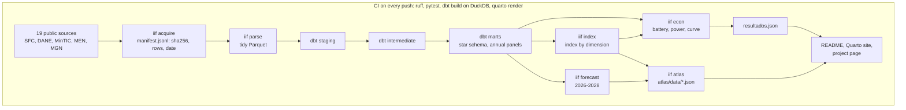

# Financial inclusion and regional growth in Colombia

[](https://github.com/DavinsonR/financial-inclusion-colombia/actions/workflows/ci.yml)
[](LICENSE)
[](docs/LICENCIAS_DATOS.md)


[](CITATION.cff)

*[Leer en español](README.es.md)*

**Reproducible research: an open warehouse of 19 public sources, a financial-inclusion index by dimension, annual department and municipality panels, an interactive atlas of all 1,123 municipalities, and a full econometric battery against spurious correlation.**

**Davirson Novoa Ramírez** · GitHub [@DavinsonR](https://github.com/DavinsonR) · [davirson.com](https://davirson.com) — one person, one name across the repository, the citation file and the project page.

## TL;DR

- **The question.** Do Colombian regions with more access to banking grow faster, once the national ups and downs that hit every region at once are taken out?
- **The answer.** A bound, not an absence: the design rules out large effects and says openly how small an effect it could not see. The figures, with their power, are in [Main result](#main-result).
- **Why believe it.** Without time effects the same coefficient looks strongly positive (+0.027); once national trends are removed it vanishes. Across the specification curve, 50 of 80 specifications are significant without time effects and 5 of 80 with them.
- **What you can reuse.** The warehouse, the index for every municipality, the atlas and the code, under open licences. A one-page summary: [`CASE_STUDY.md`](CASE_STUDY.md).

## Why it matters

Financial inclusion is a policy goal in Colombia and across Latin America, and it is often defended with regional correlations. This project shows how much of that correlation is the national trend, measures the smallest effect the data could have detected, and publishes the result with its power instead of choosing the specification that looks best. The method transfers to any "does X predict regional growth" question built on public data.

For practitioners the reusable pieces are concrete: a clean, keyed, fingerprinted warehouse of the financial supervisor's inclusion reports and the statistics office's regional accounts; an index by municipality with published weights; and a map that anyone can open without installing anything.

MSc Economics thesis, Pontificia Universidad Javeriana (2026; supervisor: Gabriel Penagos Londoño). The question: does financial inclusion predict departmental growth once the national trends that move every department at once are taken out? The answer is published with its specification, its N, its clusters and its tests, whatever the sign.

Project page and interactive atlas: <https://davirson.com/en/research/fintech-inclusion>.

## Start here in 5 minutes

1. [Main result](#main-result): the finding, its bound and why the naive estimate misleads.
2. [`CASE_STUDY.md`](CASE_STUDY.md): problem, data, the four decisions that shaped the answer, and the stack, on one page.
3. [`src/iif/econ/power.py`](src/iif/econ/power.py): how a null result is turned into a bound (minimum detectable effect and equivalence test).
4. [`dbt/tests/assert_cifras_publicadas.sql`](dbt/tests/assert_cifras_publicadas.sql) and [`tests/test_resultados_publicados.py`](tests/test_resultados_publicados.py): the tests that fail if a published figure drifts from the code.
5. [The atlas](https://davirson.com/en/research/fintech-inclusion): the index for 33 departments and 1,123 municipalities, in the browser.

## What this project demonstrates

| Skill | Where to see it |
|---|---|
| Data acquisition with provenance (URL, sha256, row count, source date) | [`src/iif/acquire/`](src/iif/acquire/), [`config/sources.yaml`](config/sources.yaml), `data/raw/manifest.jsonl` |
| Analytics engineering: star schema, staging → intermediate → marts, data tests | [`dbt/models/`](dbt/models/), [`dbt/tests/`](dbt/tests/) |
| Index construction that measures its assumptions first (KMO before PCA, published implicit weights) | [`src/iif/index/`](src/iif/index/), [`config/index.yaml`](config/index.yaml), [ADR-015](docs/decisiones/ADR-015-seleccion-de-variables-del-indice.md) |
| Panel econometrics: two-way fixed effects, CCE, initial-exposure design, event study with pre-trends, spatial SLX, wild cluster bootstrap with cluster-robust studentisation, Holm correction | [`src/iif/econ/`](src/iif/econ/), [`metodologia/panel.qmd`](metodologia/panel.qmd) |
| Statistical power and equivalence testing for a null result | [`src/iif/econ/power.py`](src/iif/econ/power.py), [`tests/test_power.py`](tests/test_power.py), [ADR-018](docs/decisiones/ADR-018-potencia-y-equivalencia.md) |
| Specification curve (160 specifications) | [`src/iif/econ/curve.py`](src/iif/econ/curve.py), [`metodologia/especificaciones.qmd`](metodologia/especificaciones.qmd) |
| Forecasting with honest evaluation (backtest, Diebold-Mariano grouped by origin) | [`src/iif/forecast/`](src/iif/forecast/), [ADR-023](docs/decisiones/ADR-023-diebold-mariano-agrupado-por-origen.md) |
| Interactive geovisualisation (Observable JS, d3, TopoJSON) | [`atlas/index.qmd`](atlas/index.qmd), [`src/iif/export/`](src/iif/export/) |
| Reproducibility and CI: locked dependencies, pinned actions, every figure re-derived | [`.github/workflows/ci.yml`](.github/workflows/ci.yml), [`Makefile`](Makefile), `uv.lock` |
| Decision records and root-cause logging | [`docs/decisiones/`](docs/decisiones/README.md) (25 ADRs), [`docs/BITACORA_AGENTE.md`](docs/BITACORA_AGENTE.md) |
| Cloud warehouse design (written, not yet run against a real project) | [`bigquery/`](bigquery/) |

*Project documentation (guide, logbook, ADRs, methodology) is in Spanish; see [README.es.md](README.es.md).*

<a id="status"></a>
## Status

| Date | Milestone |
|---|---|
| Aug 2026 | Thesis filed with the graduate school |
| Sep 2026 | Phase 0: the `iif` package, governance documents, dbt, site and CI |
| Sep 2026 | Phase 1: 19 sources downloaded with a manifest, DIVIPOLA keys, staging of the 13 tables, the supervisor's data in long form, the 2021Q1 splice measured |
| Sep 2026 | Phase 2: facts and annual panels, index by dimension with published weights |
| Sep 2026 | Phase 3: a three-view atlas and the econometric battery with its results (ADR-016) |
| Sep 2026 | Forecast layer 2026–2028: engine and atlas export (ADR-019 to ADR-023) |
| Sep 2026 | Closing audit: referee corrections to inference and new robustness (ADR-024), Sarma-type distance fixed (ADR-025) |
| Sep 2026 | Project closed. Deferred as future work, not pending: the temporal-disaggregation annex and the manuscript (Phase 4) |
| Nov 2026 (expected) | Graduation |

The full plan, with a per-phase status light and the decisions of record, is in [`docs/GUIA_DEL_PROYECTO.md`](docs/GUIA_DEL_PROYECTO.md) (Spanish).

## What it builds

1. **Warehouse.** A star schema in dbt over every public source, with each download's vintage recorded in `data/raw/manifest.jsonl` (the `dim_vintage` table of ADR-002 is not built yet): the financial supervisor (2017Q4 to 2025Q4, plus monthly service points from 2023), the statistics office (departmental GDP 2005 to 2025, municipal value added 2011 to 2024, population 2005 to 2042, the quarterly ITAED indicator), the ICT and education ministries, and the 2024 national geostatistical framework. Engine: DuckDB locally, in CI and for the site. BigQuery as the cloud warehouse, in its free sandbox and without a card (`bigquery/`). Snowflake is kept as a later demonstration (ADR-014).
2. **Index.** A financial-inclusion index by dimension (access, use, depth) over eight normalised variables, with weights frozen over the calibration window and published variable by variable, at department and municipality level (ADR-004, ADR-015).
3. **Panels.** Annual frequency: department 2018 to 2025 and municipality 2018 to 2024; a real quarterly panel only where the statistics office publishes quarterly activity (ITAED) (ADR-001).
4. **Atlas.** An interactive map of the index by region, dimension and variable, in three views — flat, raised and municipalities — inside the project page; the data comes from `uv run iif atlas` (ADR-005).
5. **Econometrics.** Entity and time fixed effects as the baseline, diagnostics measured rather than assumed, designs that do not rely on the index being exogenous (CCE, initial exposure, an event study with pre-trends from 2006), and a wild cluster bootstrap studentised with the cluster-robust variance; all in `src/iif/econ` and published in `metodologia/panel.qmd` (ADR-016, ADR-024).

<a id="abstract"></a>
## Abstract

Does financial inclusion predict regional economic growth in Colombia, once national trends are taken out of the picture? This project rebuilds the question from primary sources instead of reusing a thesis. It assembles an open dimensional warehouse of 19 public sources (financial supervisor, national statistics office, ICT and education ministries, 2005 to 2026), resolves every series to DIVIPOLA municipal codes, builds a two-stage financial-inclusion index by dimension with frozen and published weights, and estimates annual panels at department (2018 to 2025) and municipality (2018 to 2024) level with two-way fixed effects plus a battery of tests for spurious correlation (cross-sectional dependence, common correlated effects, permutation placebos, initial-exposure design, event study with pre-trends, spatial dependence). Every published figure traces to a test. The headline is a bound rather than an absence: with wild-cluster-bootstrap inference over 33 clusters, the design rules out effects larger than about 0.55 percentage points of annual growth per standard deviation of the index's identifying variation (about 2 pp per raw cross-sectional standard deviation), and it cannot rule out ±0.5 pp.

## Research question

Does financial inclusion predict the economic growth of Colombian departments and municipalities once the national trends that move them all at once are taken out?

The baseline regressor is the **contemporaneous** index; the lag is built and published beside it (+0.007, p = 0.25), and which of the two runs is decided by `REZAGO_INDICE` in `src/iif/econ/run.py`, the single source of truth for that choice. Neither ordering constitutes a causal identification strategy. The project's language is predictive, except in the designs (initial exposure, event study) that do look for plausibly exogenous variation.

<a id="data"></a>
## Data

Nineteen sources, all verified online with URL, row count and licence, downloaded by `iif acquire` and recorded in `data/raw/manifest.jsonl` with a sha256, the source date and the row count:

| Source | Grain | Frequency | Coverage | Licence |
|---|---|---|---|---|
| Financial supervisor `ptgf-ywrb`, financial inclusion (legacy) | institution × municipality × block | quarterly | 2017Q4–2021Q1 | CC BY-SA 4.0 |
| Financial supervisor `kx2f-xjdq`, financial inclusion (current) | institution × municipality × block | quarterly | 2021Q1–2025Q4 | CC BY-SA 4.0 |
| Financial supervisor `vkbt-desu`, service points | institution × municipality × channel | monthly | 2023-01 onwards | CC BY-SA 4.0 |
| Statistics office, departmental GDP (3 tables), by activity, backcast | department | annual | 2005–2025pr | public |
| Statistics office, municipal value added | municipality | annual | 2011–2024p | public |
| Statistics office, population `_VP` | municipality, department | annual | 2005–2042 | public |
| Statistics office, ITAED | 13 departments (Bogotá included), rest and national total | quarterly | 2015Q1–2026Q1pr | public |
| Statistics office, Bogotá quarterly GDP, ISE, territorial EMMET | Bogotá, national, domains | quarterly, monthly | to 2026 | public |
| ICT ministry `n48w-gutb`, fixed internet | municipality × provider | quarterly | 2016Q1–2023Q3 | CC BY-SA 4.0 |
| Education ministry `nudc-7mev` | municipality | annual | 2011–2024 | CC BY-SA 4.0 |
| National geostatistical framework 2024 | 33 departments, 1,121 municipalities | no period | no period | public, attributed |

What we already know about the data, each with its test:

- The supervisor's two tables carry the DIVIPOLA code implicitly: `renglon` is the municipal code and `999` the departmental total; 100% coverage across the 34 quarterly cuts (S-009, S-010).
- The departmental total row is the exact sum of the municipal ones in the legacy table; in the current one it diverges by up to 2.2% on banking correspondents from 2022Q3 (B-032). The two are never added together.
- Quarter 2021Q1 exists in both tables: the median relative difference between them is 0.02%, and the worst department 1.8% (B-033, ADR-009).
- The supervisor's zeros outside the product block, and the education ministry's zero rates, are missing values, not zeros (ADR-008, R-13).
- The previous quarterly panel is frozen in `data/legacy/`; it feeds no result.

Licences and attribution per source: [`docs/LICENCIAS_DATOS.md`](docs/LICENCIAS_DATOS.md). Data model: [`datos/modelo-de-datos.qmd`](datos/modelo-de-datos.qmd).

<a id="method"></a>
## Method

1. **Annual frequency and two panels** (ADR-001). Subnational GDP is annual; no annual value is ever repeated across four quarters. A department panel 2018 to 2025 (33 units), a municipal panel 2018 to 2024 (about 1,100), and a quarterly panel only for the 13 departments with ITAED. Temporal disaggregation (Chow-Lin, Denton) is an annex with caveats (ADR-010).
2. **A two-stage index** (ADR-004, ADR-015). Subindices by dimension (access, use, depth) and a composite; weights fitted over the initial window and frozen; standardisation rather than min-max; implicit weights per variable always published; PCA and a Sarma-type distance as alternatives (ADR-025). Amounts are normalised by the **lagged** product, not the contemporaneous one: the same GDP sits in the dependent variable, and dividing by it manufactures correlation (ADR-017).
3. **A battery against spurious correlation.** Entity and time fixed effects as the baseline; panel unit root with cross-sectional dependence (CIPS); estimation in index changes; common correlated effects (CCE); a permutation placebo over trajectories; an initial-exposure design (the 2018 index × national adoption; it is not a shift-share in the Bartik sense); an event study around 2020 with pre-trends measured on real GDP from 2006; spatial dependence (Moran and SLX; SAR/SDM are not estimated with T = 7); a wild cluster bootstrap studentised with the cluster-robust variance, with Rademacher and Webb weights; equivalence tests on t(G − 1); and a Holm correction over the family of contrasts (ADR-024). Never subsamples with few clusters.
4. **Traceability.** Every published figure traces to a test, a row of the verification ledger, or a dbt test (R-09).

<a id="main-result"></a>
## Main result

**With entity and time fixed effects, this design rules out an effect of the financial-inclusion index on departmental growth larger than about 0.55 percentage points per standard deviation of the index's identifying variation (about 2 pp per raw cross-sectional standard deviation) — and cannot speak to anything smaller.** Thirty-three departments, 2019 to 2025, N = 228: β = +0.0038 (SE 0.0062, p = 0.54 on t(32)); wild cluster bootstrap with cluster-robust studentisation p = 0.55 (Webb weights 0.54); permutation placebo p = 0.51. Without time effects the same coefficient is +0.027 with p < 0.001: that distance is what the national trend was worth.

The statement is a bound, not an absence, because a null without its power does not distinguish "there is no effect" from "this design would not see one" (ADR-018). The minimum detectable effect at 80% power is 0.60 percentage points of annual growth per identifying standard deviation (2.2 pp per raw standard deviation). Equivalence testing with the bootstrap, the reference inference, **fails** to rule out ±0.50 pp (p = 0.07) and ±0.25 pp (p = 0.29) and rules out ±1.0 pp (p = 0.001); the analytic t(32) version passes ±0.50 pp only narrowly (p = 0.04). The smallest margin the bootstrap rules out is 0.55 pp. An earlier version of this README claimed ±0.50 pp; the referee corrections of ADR-024 (degrees of freedom and bootstrap studentisation) are what moved it. The reason for the limited power is measured, not asserted: two-way fixed effects remove 92% of the index's variance, from a standard deviation of 1.24 to 0.34, and five departments carry 47% of the identifying weight (Aronow-Samii; about 15 effective units).

The null is robust to everything tried against it. Leaving out one department at a time, the coefficient stays between +0.000 (without Vichada) and +0.008 (without Arauca) and is never significant; without Bogotá it is +0.003. Dropping 2020, 2021, 2024 or 2025 leaves it null. So do the three dimensions on their own, the specification in changes, CCE with heterogeneous loadings, the spatial SLX, the alternative PCA and Sarma-type indices, a baseline without the Nickell-biased convergence control (+0.0005, bootstrap p = 0.93), the fixed-denominator index (+0.0053, p = 0.35), a dependent variable without mining and finance (+0.0031, p = 0.33), the lead of the index as a reverse-causality check, and a population-weighted version (+0.0062, p = 0.19). In natural units, the access coefficient is +0.14 pp of growth per 10 active banking correspondents per 10,000 inhabitants (95% CI −0.41 to +0.69). Pre-trends from 2006 are not rejected (bootstrap p = 0.41).

The only design with a signal is the initial-exposure design (the 2018 index × national adoption; +0.017, p = 0.005), which survives its own wild bootstrap (p = 0.013) and its own placebo (p = 0.004). It does not survive the contrast that matters: initial urbanisation produces an equally significant slope on its own, and with both exposures in the same equation the index falls to p = 0.10. Nor does it survive a Holm correction over the twelve contrasts published (adjusted p = 0.09; no contrast survives). It is published as a differential slope for the more urban departments, not as an effect of the index.

Every figure comes from `data/processed/econ/resultados.json` (`uv run iif econ`) and is read in `metodologia/panel.qmd`; the design is in ADR-016, ADR-018 and ADR-024, and the tests over synthetic panels in `tests/test_econ.py` and `tests/test_power.py`.

<a id="diagnostics"></a>
## Diagnostics

| Test | Result |
|---|---|
| Pesaran's CD on the baseline model's residuals | 2.40 (p = 0.016): weak but present cross-sectional dependence. Driscoll-Kraay is reported as a note only: with T = 7 it is not credible (ADR-024) |
| CIPS on the index | −2.10 with T = 8: below the 10% tabulated critical value, so an indication of stationarity, not a verdict |
| Moran's I **on the residuals** by year, contiguity from the TopoJSON arcs | significant in 2019 (0.26, p = 0.015); the SLX does **not** absorb it (0.25, p = 0.028). Measured on raw growth instead, the significant years would be 2022 and 2025 — a different question and the wrong one (B-068) |
| Minimum detectable effect and equivalence | MDE₈₀ = 0.60 pp per identifying SD (2.2 pp per raw SD), on t(32); bootstrap equivalence at ±1.0 pp, not at ±0.50 pp (p = 0.07) nor ±0.25 pp |
| Pre-trends, 2006–2018, real GDP growth on 2018 exposure × year | joint test not rejected: bootstrap p = 0.41 (0.67 controlling for urbanisation × year) |
| Family of twelve contrasts (Holm) | four unadjusted p < 0.05; none survives the correction (smallest adjusted p = 0.09) |
| Sampling adequacy of the index by dimension | KMO 0.317 for use and 0.407 for depth: below 0.5, which is why there is no PCA (ADR-015) |
| Denominator placebo: index with 2018 numerators frozen, so it moves only through its denominators | with the contemporaneous product β = −0.23 (p < 0.001); with the lagged product −0.13 (p = 0.03): the lag reduces the mechanical bias but does not remove it; with a fixed 2018 denominator +0.13 (p = 0.44). Hence the fixed-denominator index is published as co-principal (ADR-017, ADR-024) |

Figures from `data/processed/econ/resultados.json` and `data/processed/indice_diagnosticos.csv`; each with its test in `tests/test_econ.py`, `tests/test_power.py`, `tests/test_index.py`, `tests/test_resultados_publicados.py` or in `dbt/tests/`.

## How to run it

```bash
make setup           # uv sync with every group, plus the Jupyter kernel
make quarto-install  # Quarto from a tarball (no gh, no apt)
make data            # raw downloads from the `data-v1` Release, checked against the manifest
make acquire         # re-downloads the 19 sources from the original public endpoints
make parse           # statistics-office XLSX and framework GeoJSON into tidy Parquet
make index           # the financial-inclusion index (ADR-015)
make forecast        # the 2026-2028 forecast layer (ADR-019 to ADR-023)
make atlas           # atlas/data/*.json from config/atlas.yaml
make check           # ruff + pytest + dbt build (DuckDB) + quarto render
```

`uv` only; never `pip install`. `make check` runs ruff, pytest, `dbt build` on DuckDB and `quarto render`; `make test-data` adds the tests that read the downloads. Rules for the assistant: [`CLAUDE.md`](CLAUDE.md).

## Layout

```
.
├── CLAUDE.md, Makefile, pyproject.toml, uv.lock   rules, commands, dependencies
├── config/            sources.yaml (19 sources); index, atlas, forecast; tesis_documento.yaml
├── data/
│   ├── raw/           downloads by source and year (outside git, `make data`); manifest.jsonl versioned
│   ├── interim/       tidy Parquet from the statistics office, the framework and the supervisor's key reports
│   ├── processed/     index, econometric and forecast results
│   └── legacy/        the previous quarterly panel, frozen; it feeds no result
├── db/                local iif.duckdb (ignored)
├── dbt/               star schema: seeds, staging, intermediate, marts, tests
├── bigquery/          datasets, Parquet load, partitioning, cost control, authorised views
├── snowflake/         scripts for the later demonstration (ADR-014)
├── src/iif/           config, cli, acquire, parse, crosswalk, index, econ, forecast, export, data, legacy
├── tests/             pytest; a `data` mark for tests that read downloads
├── docs/              guide, logbook, decisiones/ (ADRs), licences, legacy/
├── _quarto.yml, *.qmd project documentation in Quarto (method, data, decisions)
└── .github/workflows/ ci.yml (lint, tests, dbt, render)
```

## Documents

These are written in Spanish, the language of the thesis.

- [`docs/GUIA_DEL_PROYECTO.md`](docs/GUIA_DEL_PROYECTO.md): what is being built, a per-phase status light, the repo map, a glossary, the decisions of record, the roadmap and the open questions.
- [`docs/BITACORA_AGENTE.md`](docs/BITACORA_AGENTE.md): mistakes (B-001 onwards) and wins (S-001 onwards) with root cause and rule.
- [`docs/decisiones/`](docs/decisiones/README.md): ADR-001 to ADR-025.
- [`docs/HOJA_DE_RUTA_PROYECCION.md`](docs/HOJA_DE_RUTA_PROYECCION.md): the plan for the forecast layer.
- [`docs/LICENCIAS_DATOS.md`](docs/LICENCIAS_DATOS.md): licence and attribution per source.

<a id="que-hay-y-que-falta"></a>
## What exists and what is missing

| Piece | Status |
|---|---|
| Downloader with a manifest, 19 sources in `data/raw/` (outside git, in the `data-v1` Release), statistics-office and framework parsers | Done |
| dbt: sources, staging of the 13 tables, `dim_departamento`, `dim_municipio`, `dim_periodo`, the supervisor's data in long form by block, total and splice tests | Done |
| Quarto site and CI (the site builds inside `make check`; it is not published separately, ADR-005) | Done |
| Governance documents: guide, logbook, 25 ADRs, licences | Done |
| Dictionary of the supervisor's 98 variables with each annualisation rule | Done |
| Inclusion facts (quarterly and annual, municipal and departmental), service points, activity, internet and education | Done |
| Annual panels: department 2018–2025 and municipality 2018–2024 | Done |
| Index by dimension with frozen, published weights, and its two sensitivity versions | Done |
| Interactive three-view atlas, inside the project page | Done |
| Econometrics: `src/iif/econ`, synthetic tests for the battery and for power, `metodologia/panel.qmd` with the results | Done |
| Power, equivalence and specification curve (ADR-018); referee corrections and new robustness (ADR-024) | Done |
| Forecast 2026-2028: `src/iif/forecast`, a combination of ARIMA models with declared outliers, anchored to a national path and reconciled (ADR-019 to ADR-023); the anchor is the median of Banrep's monthly analyst survey (EME, July 2026), transcribed in `config/forecast.yaml`, with the IMF WEO as automatic fallback (ADR-021, addendum 1). In the 2018–2025 backtest it cuts the naive forecast's mean error by 38.6 %, but it wins in 3 of 8 years, the gain without 2021 is +8.3 %, and grouped by year the difference is not statistically distinguishable (p = 0.29): a scenario conditional on the anchor, not a model with proven superiority. Its 80% interval covers 81.4% of outcomes in the backtest; the anchor's cutoff and age travel with the output, which warns once it is more than 6 months old (`data/processed/forecast/resultados.json`) | Done: engine, atlas export, a scenario section on the project page, and the interactive atlas paints 2026–2028 as a scenario with its uncertainty (colour, opacity by interval width, projected-year hatching) |
| Temporal-disaggregation annex, MIDAS, manuscript | Deferred: future work, outside the scope of this project (see the guide) |
| BigQuery: dbt target, load, partitioning, cost control and authorised views | Written; not yet run against a real project |
| Snowflake demonstration (same dbt models, stage, clone by vintage) | Later, no date |
| Thesis PDF | After deposit in the Javeriana institutional repository |
| Public page, the only one | <https://davirson.com/en/research/fintech-inclusion> |

## Architecture



The tests close the loop: `tests/test_resultados_publicados.py` re-runs the battery and compares it with `resultados.json`, and `dbt/tests/assert_cifras_publicadas.sql` fails if the warehouse stops producing a figure the documentation cites.

## How this was built

This project was built by its author working with AI coding agents (Claude Code), and the commit history shows it: many commits are co-signed. The agents write code and prose; the author sets the question, takes every decision of value and answers for every module. What makes that workable is governance, written down and enforced:

- **Hard rules** in [`CLAUDE.md`](CLAUDE.md) (R-01 to R-17): single source of truth per constant, no annual value repeated across quarters, no figure without a test, no method before its assumption is measured.
- **Decisions before code**: each choice of value is an ADR in [`docs/decisiones/`](docs/decisiones/README.md) before it becomes a line of Python.
- **Root-cause logbook**: every mistake is logged in [`docs/BITACORA_AGENTE.md`](docs/BITACORA_AGENTE.md) with its cause and the rule that prevents it, before it is fixed.
- **Adversarial audits**: independent reviews tried to break the result (the denominator that manufactured correlation, ADR-017, and the power of the null, ADR-018, came out of them).
- **CI that re-derives every figure**: nothing published survives if the code stops producing it (245 pytest tests plus the dbt tests).

## How to cite

See [`CITATION.cff`](CITATION.cff). In text:

> Novoa Ramírez, D. (2026). *Inclusión financiera y crecimiento regional en Colombia: proyecto de investigación reproducible* [code and data]. <https://github.com/DavinsonR/financial-inclusion-colombia>

## Licence

- **Code** (`src/`, `dbt/`, `scripts/`, `tests/`, `notebooks/`): MIT, see [`LICENSE`](LICENSE).
- **Thesis text** (`paper/`): © 2026 Davirson Novoa Ramírez, all rights reserved until institutional deposit; afterwards, whatever licence that deposit sets.
- **Derived data** (`data/`, marts, `atlas/data/`): CC BY-SA 4.0, required by the licences of the financial supervisor, the ICT ministry and the education ministry. Attribution per source in [`docs/LICENCIAS_DATOS.md`](docs/LICENCIAS_DATOS.md) (ADR-012).
